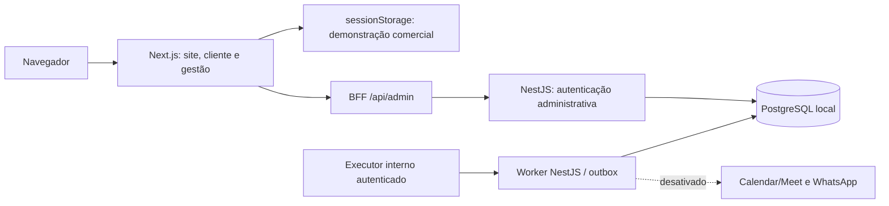
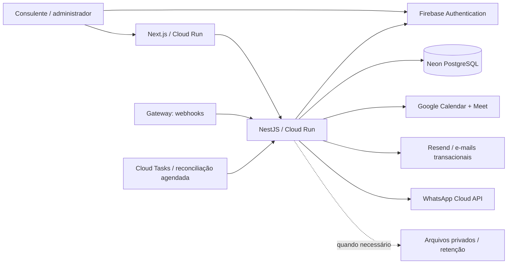

# Mapa técnico — O Tal do Marmoteiro

Atualizado em 25/09/2026. Ponto de entrada para outro desenvolvedor ou agente. Leia primeiro [AGENTS](../../AGENTS.md) e o [baseline funcional](../../o-tal-do-marmoteiro-especificacao-funcional-regulatoria-v1.0.md). Este mapa descreve o código e a direção técnica; não substitui as regras comerciais/jurídicas.

## Leitura rápida

Para configurar as contas como proprietário, comece pelo [passo a passo de configuração e primeira publicação](./configuracao-das-contas.md). Ele inclui consoles, nomes dos recursos, permissões, segredos e comandos, sem presumir que a integração já esteja ativa.

1. Este mapa: responsabilidades e estado real.
2. [Fluxos e contratos](./fluxos-e-contratos.md): identidade, contratação, agenda, pagamento e comunicações.
3. [Custos e alternativas](./custos.md): franquias, hipóteses e por que manter PostgreSQL.
4. [Deploy e operação](./deploy.md): variáveis, publicação, migração, verificação e rollback.
5. [Próximas etapas e handoff](./handoff.md): sequência de implementação, critérios de conclusão e bloqueios externos.
6. ADRs [0001](../adr/0001-escolha-da-stack-tecnologica.md), [0002](../adr/0002-acesso-administrativo-e-canais.md), [0003](../adr/0003-infraestrutura-baixo-custo-e-firebase.md).
7. [Git Flow](./git-flow.md): branches, integração, releases, sincronização e limpeza.

## Estado real

| Área | Implementado | Ainda necessário para operação real |
| --- | --- | --- |
| Site | Landing e identidade visual do Figma; assets/fontes locais | Domínio/hosting remoto; conteúdo final |
| Cliente | Cadastro/login, checkout, histórico, solicitações e notas demonstrativos | Firebase Auth, sessão, autorização e persistência da conta real |
| Admin | Login real, hash scrypt, sessões PostgreSQL, proteção BFF/API, provisionamento restrito | Publicação do banco/API e criação/associação do acesso remoto; RBAC ampliado |
| Domínio | Máquinas de estado, fila/SLA por calendário injetado, reagendamento, reembolso, retenção e correção cadastral com testes e contratos de cálculo `/api/v1` | Orquestração transacional autorizada, auditoria dos comandos, calendário e integrações reais |
| Gestão | Oito telas com dados fictícios, filtros, métricas, agenda, fila e ações locais | Comandos de domínio autorizados no backend; indicadores calculados sobre ledger real |
| Perguntas | Pergunta/contexto no checkout e visualização administrativa restrita; foto/áudio como confirmação simulada | Persistência cifrada, auditoria de leitura e entrega real |
| Pagamento | Estados e regras de prévia separados | Gateway, webhook assinado, idempotência, reconciliação e estorno real |
| Agenda | Slots/hold/reagendamento/cancelamento na prévia | Exclusividade transacional, concorrência, expiração e integração com disponibilidade pessoal |
| Comunicações | Outbox PostgreSQL e adaptadores Calendar/Meet/WhatsApp; execução por chamada interna autenticada | Eventos confiáveis de domínio, Cloud Tasks/OAuth, e-mail comercial, consentimentos persistidos e recibos |
| Infraestrutura | Dockerfiles, Next standalone, App Hosting config, build Cloud Run, CI e limites de pool | Contas/projeto remoto autenticados, faturamento escolhido, deploy e smoke test remoto |

A conta administrativa criada durante a validação pertence ao PostgreSQL local. Nenhuma senha ou conta deve ser copiada para Git, YAML ou documentação. Migrar banco ou provisionar administrador remoto é etapa explícita do deploy.

## Componentes em execução hoje

## Destino recomendado

Setas desse segundo desenho representam a arquitetura de destino, não integrações já conectadas. Próxima etapa de autenticação usará UID Firebase associado ao cadastro relacional, sem duplicar credenciais do cliente. Detalhes íntimos não circulam em calendário, e-mail, métricas ou logs.

## Mapa do repositório

| Caminho | Responsabilidade |
| --- | --- |
| `apps/web/src/app` | Rotas Next.js; `/gestao/(painel)` exige sessão no servidor; `/api/admin` é BFF |
| `apps/web/src/components/portal` | Jornadas demonstrativas do cliente; `DemoProvider` mantém estado por aba |
| `apps/web/src/components/management` | Interface de gestão; `ManagementProvider` só monta sob acesso administrativo |
| `apps/web/src/lib/demo-bookings.ts` | Modelo de apresentação e regras temporais da prévia |
| `apps/web/src/lib/management.ts` | Projeções demonstrativas: fila, financeiro, disponibilidade e comunicações |
| `apps/web/src/lib/refund-policy.ts` | Regras de decisão demonstrativas; precedência legal e revisão manual |
| `apps/web/src/lib/preview-events.ts` | Ponte local cliente/gestão e disponibilidade genérica; nunca autoriza operação real |
| `apps/web/src/lib/server/admin-auth.ts` | Comunicação privada com API, leitura de cookie e autorização por sessão |
| `apps/api/src/modules/identity/admin` | Credenciais, limites de tentativas, sessões e guards |
| `apps/api/scripts/admin.ts` | Criar/redefinir/desativar administrador com senha oculta e auditoria |
| `apps/api/src/modules/notification` | Worker de outbox, endpoint de jobs e adaptadores externos |
| `apps/api/prisma/schema.prisma` | Modelo relacional; enums de domínio reconciliados e histórico de execução preservado |
| `apps/api/prisma/migrations` | Migrações incrementais; não usar reset/db push em ambiente compartilhado |
| `packages/shared/src` | Tipos e contratos compartilhados, sem SDK de provedor |
| `apps/*/Dockerfile`, `infra/`, `.github/workflows` | Build portável e validação; não contêm segredos |
| `docs/product`, `docs/legal`, `docs/adr` | Baseline, fontes jurídicas/inventário e decisões técnicas |

## Dados e limites de acesso

`AdminUser`/`AdminSession` são independentes da identidade do cliente. Token opaco aleatório só aparece no cookie HttpOnly; banco guarda seu hash. `AdminLoginBucket` limita tentativas; papéis desconhecidos, conta inativa e sessão expirada/revogada negam acesso. A validação é feita em páginas e APIs, não apenas na navegação.

O schema separa `Customer`/`CustomerContact`, `Order`/`OrderItem`, `PaymentTransaction`/`Refund`, `QuestionRequest`, `Appointment`/`AppointmentSlot`, solicitações, decisões de restituição, documentos/aceites, consentimentos e `AuditLog`. `AppointmentCommunication` guarda IDs/links operacionais; `AppointmentReminderConsent` guarda autorização específica. `OutboxMessage` tem chave de deduplicação, próxima tentativa, lease e código de falha.

Essas tabelas não significam que todos os comandos já estejam implementados. O navegador demonstrativo não escreve pedidos financeiros reais no banco. Status de pedido, pagamento e atendimento continuam independentes.

## Configuração e execução

Desenvolvimento: Postgres local, API na porta 3001 e web na 3008. Redis pode permanecer no compose para pesquisa futura, mas não é dependência da aplicação atual. Comece por [acesso administrativo](../acesso-administrativo.md) e [deploy](./deploy.md).

Segredos server-only: `DATABASE_URL`, `ADMIN_API_SECRET`, `OUTBOX_TRIGGER_SECRET`, tokens Google/Meta e futuros gateway/e-mail. Nunca usar prefixo `NEXT_PUBLIC` para esses valores. Variáveis públicas futuras do SDK Firebase serão apenas a configuração pública do projeto; autorização continua no servidor/regras.

`COMMUNICATIONS_ENABLED=false` é o padrão seguro para a prévia. `OUTBOX_RUNNER=scheduled` termina o lote antes da resposta HTTP. `poll` só serve a processo persistente e é recusado em Cloud Run. Retorno do job informa tentativas, não entrega de mensagens.

## Crescimento e operação

API começa com pool três, máximo duas instâncias sugeridas e mínimo zero. Monitorar duração/erros HTTP, latência/pool PostgreSQL, uso de armazenamento/compute, atraso da outbox, jobs em revisão, falhas de e-mail/Meta e gasto por provedor. Limites são configuráveis e serão medidos em produção.

Manter rollback de release, backup cifrado e restauração ensaiada. Arquivos grandes ficam fora do banco transacional, com acesso temporário e retenção conforme finalidade. Observabilidade não recebe pergunta, resposta, gravação, tokens, senhas ou payload integral de cobrança.

Atualize este mapa e o ADR correspondente quando uma decisão mudar. Toda entrega funcional deve indicar o que deixou de ser simulação, o contrato/API afetado, migração, evento/auditoria, testes e como voltar atrás.
