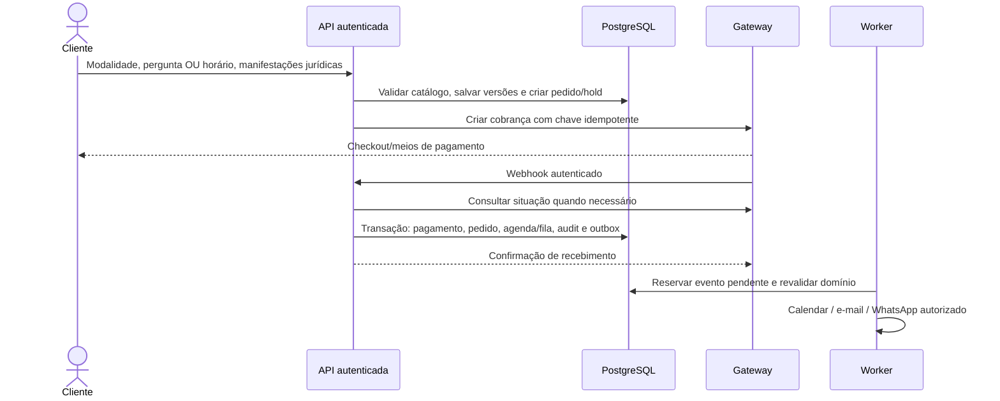

# Fluxos técnicos e contratos

Estado em 22/09/2026. Regras funcionais completas: [fluxos operacionais](../product/fluxos-operacionais.md) e [invariantes](../product/regras-de-negocio-e-invariantes.md). Os contratos abaixo distinguem implementação existente e desenho futuro.

## Endpoints existentes

| Camada / endpoint | Proteção | Comportamento |
| --- | --- | --- |
| Web `POST /api/admin/auth/login` | Origem exata e limitação de tamanho; API limita tentativas | Encaminha credenciais ao NestJS, recebe sessão e grava cookie HttpOnly/Strict; Secure em produção |
| Web `GET /api/admin/auth/session` | Cookie válido verificado no backend | Identidade do administrador, sem token/hash |
| Web `POST /api/admin/auth/logout` | Origem exata e cookie | Revoga sessão no backend e apaga cookie |
| Web `GET /api/admin/integrations/status` | Cookie e sessão ativa | Estado de configuração; não valida conexão externa nem envia mensagem |
| API `POST /admin/auth/login` | `x-admin-service-key` privado, contas existentes | Scrypt, limites persistidos, sessão de oito horas e auditoria |
| API `GET /admin/auth/session` | Chave de serviço + bearer opaco | Checa conta ativa, OWNER, expiração, revogação e atualização da conta |
| API `POST /admin/auth/logout` | Chave de serviço + bearer | Revoga o token indicado |
| API `GET /admin/integrations/status` | Chave de serviço + sessão OWNER | Configuração da integração sem revelar segredos |
| API `POST /internal/jobs/communications` | `x-outbox-secret`, exclusivo e mínimo 32 caracteres | Aguarda lote de até cinco jobs; retorna `enabled`, `attempted` e opcional `busy`. Não recebe IDs/pagamentos do navegador |

Não existem endpoints reais de signup administrativo, checkout, confirmação de pagamento, refund ou agendamento nesta etapa. CLI de provisionamento é o canal restrito de criação de administradores. Novas APIs de negócio exigirão seus próprios guards/validação; não basta colocar uma URL sob `/admin`.

Os contratos de cálculo do PR #6 estão sob `/api/v1`: máquinas de estado, ordenação de fila, elegibilidade de reagendamento e avaliação de reembolso. Recebem dados informados e retornam cálculos; não leem recursos privados, persistem estados nem fazem chamadas financeiras. `withdrawal` no cálculo de reembolso exige enquadramento explícito; omitido ou indeterminado não autoriza retenção. A verificação real de usuário/recurso e fatos financeiros deve ocorrer no futuro caso de uso persistente. As URLs da tabela acima e `GET /` são preservadas pela configuração compartilhada de HTTP.

## Login administrativo atual

```mermaid
sequenceDiagram
  actor Dono
  participant Web as Next.js BFF
  participant API as NestJS
  participant DB as PostgreSQL
  Dono->>Web: E-mail e senha por HTTPS
  Web->>Web: Validar Origin / tamanho
  Web->>API: Credenciais + chave privada de serviço
  API->>DB: Limitar tentativas e buscar conta
  API->>API: Verificar scrypt, ativo e OWNER
  API->>DB: Hash de sessão + auditoria
  API-->>Web: Token opaco e identidade
  Web-->>Dono: Cookie HttpOnly; identidade sem token
  Dono->>Web: Abrir /gestao
  Web->>API: Validar sessão novamente
  API-->>Web: Identidade ou rejeição
```

O provider demonstrativo administrativo só monta depois da autorização. O navegador verifica a sessão também em navegação/foco e periodicamente enquanto visível. API/banco indisponível nega acesso. Reset/desativação revogam sessões; cadastro público do cliente nunca concede papel administrativo.

## Firebase — próxima etapa funcional

1. Cliente autentica no Firebase (provedores a habilitar no projeto, inicialmente e-mail/senha).
2. O servidor verifica ID token com SDK oficial, projeto/audience/issuer e revogação quando aplicável; não confia em UID/e-mail enviados soltos pelo navegador.
3. Associar UID a um `Customer` único, com transação e processo de onboarding. Dados protegidos seguem o workflow de correção; campos do perfil Firebase não substituem o cadastro contratual.
4. Sessão do site é emitida/validada pelo servidor. Definir política de verificação de e-mail, recuperação, logout e desativação antes de habilitar uso comercial.
5. Para admin, manter registro autorizado no servidor; eventual claim é atribuída apenas por ambiente privilegiado e não substitui checagem de conta ativa. Migrar acesso atual com vínculo explícito, sem importar senha pelo frontend.

Este fluxo é desenho aprovado de direção, não código implementado de Firebase. A autenticação do cliente permanece demonstrativa até concluir essa etapa.

## Contratação/pagamento — operação desejada



O retorno do checkout nunca aprova pagamento. Webhooks repetidos/fora de ordem são normais e precisam de deduplicação/reconciliação. Testar também cobrança compensada depois do hold expirar; não confirmar um horário já vendido nem perder o registro financeiro.

Valores monetários no banco usam Decimal; a prévia usa centavos inteiros. Fixar contrato monetário por endpoint, moeda e arredondamento. Nunca usar float para cálculo de restituição. Catálogo, prazos e calendário operacional não devem ficar hardcoded como regra permanente.

## Pergunta avulsa

Após pagamento confiável: fila com prioridade antes da regular, FIFO por confirmação dentro de cada grupo. O SLA continua 48 horas úteis com calendário configurado, sem interromper atendimento iniciado. Início é ação humana auditada. Entrega exige identificação da pergunta, foto e áudio no WhatsApp. Iniciar não elimina automaticamente direitos de arrependimento/cancelamento.

Conteúdo da pergunta é dado restrito. A prévia coleta e mostra exemplos no navegador; produção exigirá persistência segregada/cifrada e trilha de acesso. E-mails, calendário, dashboards e logs recebem somente metadados mínimos.

## Videochamada, alteração e cancelamento

Confirmação transacional do slot gera evento de domínio. `enqueueCalendar(tx, appointmentId)` deve ser chamado dentro dessa mesma transação. O worker lê pagamento aprovado/confirmado, pedido/atendimento válidos e versão do slot antes de criar evento privado e Meet. Google envia convite ao e-mail por `sendUpdates=all`.

Reagendamento confirma novo slot antes de consumir o direito do consulente; pedidos do prestador não consomem esse direito. Ao confirmar mudança, gravar evento para atualizar Calendar e substituir lembretes. O worker compara revisões e não envia lembrete antigo. Alteração durante chamada ao Google provoca reconciliação posterior.

Cancelamento solicitado fica em análise, preservando contexto. Cancelamento efetivo remove evento e invalida lembretes. A decisão financeira e a confirmação bancária de estorno são etapas diferentes. Exceções manuais exigem justificativa e auditoria; conteúdos e percentuais continuam no baseline.

## Outbox e entrega

- Estado persistente: `PENDING`/`RETRY` → `PROCESSING` com lease → `PROCESSED`, `ACCEPTED`, `SKIPPED`, `FAILED` ou `MANUAL_REVIEW`.
- Claim usa `FOR UPDATE SKIP LOCKED`; chave única evita duplicar a mesma intenção. Mais de uma instância deve disputar pelo banco, nunca por flag em memória somente.
- `ACCEPTED` é aceite da API WhatsApp, não entrega/leitura. Webhooks de recibo e armazenamento do ID da mensagem são trabalho pendente.
- WhatsApp revalida consentimento específico, versão/data, número, horário, pagamento e cancelamento. Timeout ambíguo entra em revisão para não enviar duas vezes sem saber o que ocorreu.
- Google usa ID estável por atendimento, permitindo reconciliar criação após falha de conexão. Link Meet pendente não é substituído por URL inventada.
- O endpoint de jobs não aceita um payload comercial arbitrário. Processa só a outbox já existente; sem `COMMUNICATIONS_ENABLED=true`, não consulta jobs nem chama provedores.
- Cloud Tasks/OIDC e agendamentos reais ainda não estão implementados. O endpoint com chave dedicada prepara o runtime para acionamento externo. Não cadastrar cron a cada minuto supondo que o banco permanecerá gratuito.

## Demonstração entre as áreas

`DemoProvider` publica eventos do cliente numa fila por aba. Após login, `ManagementProvider` atualiza suas projeções e prévias de e-mail; só remove eventos depois de salvar a projeção, evitando perda no replay de efeitos React. IDs processados deduplicam a importação. Nenhum desses eventos tem autoridade sobre pagamentos externos.

Disponibilidade compartilhada contém horários e rótulos genéricos. SessionStorage não oferece sincronização entre dispositivos nem persistência comercial. O substituto será API autenticada com modelos e regras do servidor, etapa a etapa.

## Observabilidade e testes por integração

Registrar referência interna, evento, tentativa, resultado, duração e código de erro; omitir tokens, credenciais, conteúdo íntimo e corpo integral de webhook. Testes de contrato devem incluir assinatura inválida, repetição, timeout, cancelamento concorrente, evento fora de ordem, destinatário alterado e provedor indisponível. Ambiente de homologação usa sandbox e destinatários autorizados; dados fictícios nunca acionam envio comercial.
